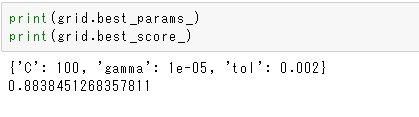
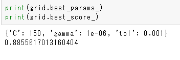

# machine-learning-challenge
Optional homework for machine learning

### Objective: Build a machine learning model

As this homework is optional, I didn't spend to much time to solve the problem in details. 
I built a GridSearch model and played with grid parameters to tune the model. 

I applied three sets of paramaters: 

- set 1: 
 

- set 2:  
 

- set 3: 
 

Scores obtained for: 
- set 1: 
 

- set 2:  
 

- set 3: 
 

### Conclusion
Tuning hyper-parameters to obtain a better model is time demanding. Trying to optimize parameters to obtain a better model might not be so meaningful as the amount of additional information is small. 
